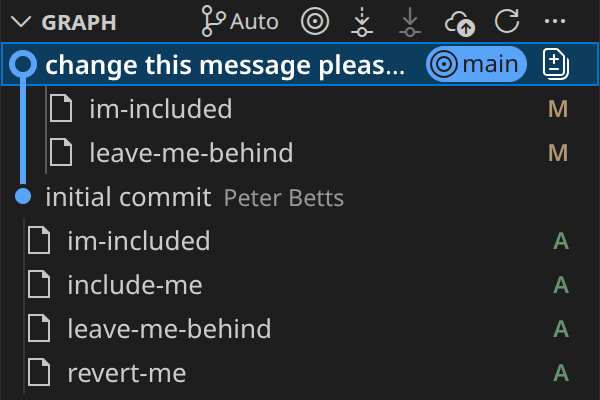

# Amending/Undoing - Challenge
For this challenge, you'll be doing stuff that isn't easily tracked, and we want to start you off with a messed up repo. GitHub doesn't like to host repos with uncommitted changes or untracked files (obviously), so the repo is in a .zip file [here](https://github.com/peterbetts/micro-teach-amending-undoing-challenge).

## Instructions
- Download and unzip the .zip file containing the challenge repo
- You'll see that some files are staged and others aren't
- Using the `git status` command and/or the Source Control panel, you'll see that the repo is in limbo
- Your job is to clean up the repo so that the following are true:
    - The most recent commit's message is changed (can be anything, just change it)
    - im-included is included in the most recent commit
    - include-me is included in the most recent commit
    - leave-me-behind is not staged or included in the most recent commit
    - revert-me has its changes discarded
- Once that's done, wrap it up in a new commit that fits the following specifications:
    - im-included, include-me, and revert-me are included
        - **Note:** if you've done the first section correctly, you'll need to add new content to the files so that they have changes to be staged
    - leave-me-behind is not included
    - The commit message describes how you felt about this challenge

**Another note:** if you screw it up, you can always delete the folder and re-extract it from the challenge.zip file.

**Final note:** you can see which files have been included in each commit by opening the Source Control panel and clicking the commit message in the "Graph" section

